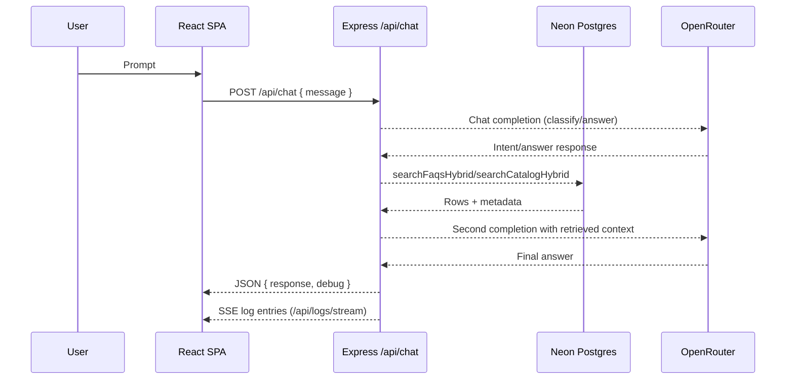

<!-- agent-update:start:architecture-notes -->
# Architecture Notes

The system is a single TypeScript workspace that bundles a Vite-powered React client and an Express server into one deployable artifact. Express serves as the orchestration layer: it renders the SPA (dev via Vite middleware, prod via static assets), exposes the `/api/chat` endpoint, streams structured logs over SSE, and mediates all calls to OpenRouter and Postgres. Retrieval happens through Drizzle ORM so the same schema definitions are shared with scripts, server logic, and future tooling.

## System Architecture Overview
- **Topology:** Monorepo + monolith. Express owns HTTP ingress, persistence access, and AI orchestration. The React SPA is bundled alongside the API.
- **Deployment:** `npm run build` emits `dist/public` for the client and `dist/index.js` for the server (esbuild). Vercel can serve the static assets while the Node handler runs on the same target.
- **Request path:** The SPA posts `/api/chat` → Express logs request metadata → classifica intenção via OpenRouter → consulta Postgres com `searchFaqsHybrid`/`searchCatalogHybrid` conforme o plano → executa a segunda chamada com o contexto retornado → responde ao SPA e transmite logs via `/api/logs/stream`.

## Core System Components
- **React SPA (`client/`):** Chat UI, log terminal, hooks, and shadcn UI primitives. Talks to the API via `apiRequest` and renders SSE logs.
- **Express host (`server/`):** `app.ts` wires middleware and request logging, `routes.ts` handles `/api/chat` orchestration, `log-stream.ts` provides SSE, and `index-*.ts` select dev/prod hosting mode.
- **Storage layer (`server/storage.ts` + `shared/schema.ts`):** Drizzle ORM table definitions, search helpers with normalization/tokenization, and catalog seeding utilities.
- **Plans/scripts (`plans/`, `scripts/`):** Lightweight ADRs and CLI helpers such as catalog seeding that document why retrieval behaves the way it does.

## Internal System Boundaries
- **Shared schema contract:** Types from `shared/` are the single source for Drizzle + Zod, ensuring Express handlers, scripts, and migrations agree on field names/enums.
- **Storage interface:** `IStorage` abstracts Postgres access so the router interage via `searchFaqs` (híbrido quando habilitado) / `searchCatalogHybrid` sem tocar Drizzle diretamente.
- **Tool orchestration seam:** `routes.ts` is the only module aware of OpenRouter tool schemas; all text processing and data access happens in storage utilities to ease testing/swapping.
- **Client/server contract:** React only knows about `/api/chat` and `/api/logs/stream`, keeping UI changes isolated from backend prompt logic.

## System Integration Points
- **Inbound:**
	- `POST /api/chat` — JSON body `{ message: string }` processed by `server/routes.ts`.
	- `GET /api/logs/stream` — SSE endpoint consumed by `LogTerminal` for observability.
- **Outbound:**
	- `OpenRouter` — `https://openrouter.ai/api/v1/chat/completions` usado em uma ou duas chamadas por requisição, sempre com tools em modo `auto`.
	- `Neon/Postgres` — connection via `@neondatabase/serverless` websockets; queries executed through Drizzle.

## External Service Dependencies
- **OpenRouter:** Authenticated with `OPENROUTER_API_KEY`. Fallback behavior is limited—errors bubble to the client with a 500 payload while logs capture the failing status/body for debugging. Respect usage quotas; consider implementing exponential backoff if throttling increases.
- **Neon/Postgres:** `DATABASE_URL` drives both runtime and migrations. The Neon serverless driver needs websocket support (`ws` polyfill). Any schema drift requires `npm run db:push`.
- **Vercel (target deployment):** `vercel.json` codifies the `npm run build`/`dist/public` expectations. Keep bundle size and cold start budgets in mind when adding dependencies.

## Key Decisions & Trade-offs
- Kept a **single Express host** instead of splitting API/UI so SSE log streaming and prompt logging stay co-located.
- Adopted **OpenRouter function calling** to defer routing decisions (FAQ vs catalog) to the LLM; heurísticas de força de tool foram removidas para simplificar o fluxo e depender apenas de instruções no prompt.
- **Text normalization + tokenization** (documented in `plans/searchFaqsImprovement.prompt.md`) was chosen over Postgres full-text search for now to avoid migrations/extensions while still improving recall.
- SSE logging replicates backend insights inside the SPA to reduce context switching; the trade-off is tighter coupling between UI and backend log schema.

## Diagrams

## Risks & Constraints
- **LLM dependency:** The workflow requires two sequential OpenRouter calls; latency spikes will block responses, so consider streaming results or caching when scaling.
- **Tool opt-out:** If the LLM skips tool usage, users rely solely on model priors; atualmente o prompt incentiva buscas, mas não há heurística forçada para cobrir misses.
- **Database availability:** Neon credentials must allow websocket access; local development fails early if `DATABASE_URL` is missing.
- **Ob observability gap:** SSE logs are ephemeral. Persist important incidents elsewhere if compliance requires retention.

## Top Directories Snapshot
- `client/` — React SPA, shadcn UI, and log terminal.
- `server/` — Express entrypoints, router, SSE stream, and OpenRouter glue code.
- `shared/` — Drizzle schema + Zod types consumed by both layers.
- `plans/` & `scripts/` — Architectural context (prompted ADRs) and helper CLIs like catalog seeding.

<!-- agent-readonly:guidance -->
## AI Update Checklist
1. Review ADRs, design docs, or major PRs for architectural changes.
2. Verify that each documented decision still holds; mark superseded choices clearly.
3. Capture upstream/downstream impacts (APIs, events, data flows).
4. Update Risks & Constraints with active incident learnings or TODO debt.
5. Link any new diagrams or dashboards referenced in recent work.

<!-- agent-readonly:sources -->
## Acceptable Sources
- ADR folders, `/docs/architecture` notes, or RFC threads.
- Dependency visualisations from build tooling or scripts.
- Issue tracker discussions vetted by maintainers.

## Related Resources
- [Project Overview](./project-overview.md)
- Update [agents/README.md](../agents/README.md) when architecture changes.

<!-- agent-update:end -->
