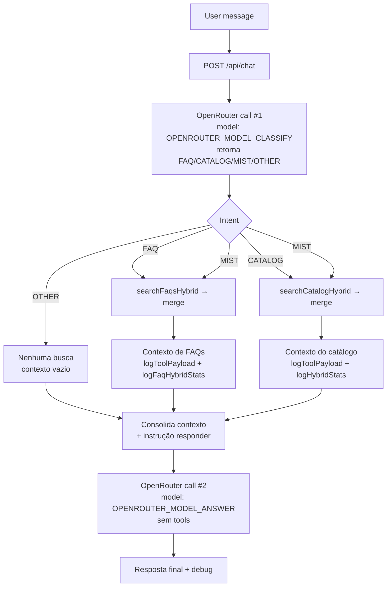

# AgroRemoto

Assistente de FAQ e catálogo com RAG híbrido (lexical + vetorial) via OpenRouter, Express e Vite.

## System flow

- O payload do chat inclui `history` (user/assistant) com as últimas interações; o backend limita o número de mensagens usadas no contexto via `CHAT_HISTORY_CONTEXT_LIMIT` (default 6, máx. 20) e trunca cada uma a ~1200 caracteres para evitar estourar tokens.
- Chamada #1 (classificação) instrui a IA a retornar **apenas uma palavra** (`FAQ`, `CATALOG`, `MIST`, `OTHER`), registrando o modelo usado (`OPENROUTER_MODEL_CLASSIFY`, `OPENROUTER_MODEL_CLASSIFY_FALLBACK` ou fallback padrão).
- O backend decide quais buscas executar com base na intenção (`searchFaqsHybrid`, `searchCatalogHybrid`, ambos ou nenhum), monta um único contexto e registra logs (`classification=...`, `usedTools`, `llmCalls=0/1/2`, `logToolPayload`, `logFaqHybridStats`, `logHybridStats`).
- Chamada #2 (`OPENROUTER_MODEL_ANSWER`) recebe somente o contexto consolidado como mensagens `system` e o texto do usuário; **não usa tools** e não pode mencionar a palavra de intenção.
- O `debug` da resposta inclui a intenção detectada, modelos usados (classify/answer), flags de banco, contagens de FAQs/itens, `ragSource`, `usedTools` e `llmCalls` coerente com as buscas disparadas.

## Variáveis de ambiente

- `CHAT_HISTORY_CONTEXT_LIMIT` (default 6, máx. 20): número de mensagens recentes (user/assistant) que entram no contexto enviado ao LLM. A API aceita um array `history` e usa apenas as últimas mensagens nessa ordem, truncando cada conteúdo a ~1200 caracteres. Ajuste para balancear recall x custo de tokens.
- `OPENROUTER_API_KEY`: necessário para gerar embeddings; sem ele, as buscas híbridas caem para o fallback lexical.
- `FAQ_HYBRID_ENABLED` (default true): ativa busca híbrida (lexical + vetorial) de FAQs; defina `false` para forçar apenas lexical.
- `FAQ_VECTOR_THRESHOLD` (default -0.5): filtro de similaridade na busca vetorial de FAQs (menor = mais próximo).
- `FAQ_VECTOR_WEIGHT` / `FAQ_LEXICAL_WEIGHT` (default 6/4): pesos no merge quando `HYBRID_SEARCH_ENHANCED=true`.
- `FAQ_SNIPPET_LIMIT` (default 220): limite de caracteres do snippet das FAQs usado no contexto/debug.
- `HYBRID_SEARCH_ENHANCED` (default false): habilita merge ponderado (FAQ e catálogo); se `false`, usa dedupe simples com prioridade vetorial.

## Canal WhatsApp (Cloud API)

- Rotas: `GET /webhooks/whatsapp` devolve `hub.challenge` quando `hub.verify_token` bate com `WHATSAPP_VERIFY_TOKEN`; `POST /webhooks/whatsapp` processa `entry[].changes[].value.messages[].text.body`.
- Envs obrigatórias: `WHATSAPP_VERIFY_TOKEN`, `WHATSAPP_APP_SECRET` (para validar `X-Hub-Signature-256` com o corpo bruto), `WHATSAPP_ACCESS_TOKEN`, `WHATSAPP_PHONE_NUMBER_ID`; opcional `WHATSAPP_CHAT_BASE_URL` (default `http://localhost:${PORT}/api/chat`).
- Fluxo: usa `message.id` para idempotência em cache em memória (~15 minutos) e deriva `sessionId` como `wa:{from}`; repassa o texto para `/api/chat` e envia a resposta via `POST https://graph.facebook.com/{version}/{phone_number_id}/messages` (default `v20.0`).
- Erros de assinatura retornam `401`, payloads sem texto retornam `200 { status: "ignored" }`, duplicatas retornam `{ status: "duplicate" }`.
- Teste rápido local: gere a assinatura com `printf '%s' "$BODY" | openssl dgst -sha256 -hmac "$WHATSAPP_APP_SECRET" | awk '{print \"sha256=\" $2}'` e envie com `curl -X POST http://localhost:3000/webhooks/whatsapp -H "Content-Type: application/json" -H "X-Hub-Signature-256: $SIGNATURE" -d "$BODY"`.

## Testes rápidos

- Híbrido direto: `curl -X POST http://localhost:3000/api/rag/search -H "Content-Type: application/json" -d '{"query":"adubo foliar","limit":5}'`
- Chat end-to-end: perguntar sobre um produto; o retorno inclui `debug` com flags do RAG.
- Backfill FAQ embeddings: `npx tsx scripts/seedFaqEmbeddings.ts`
- Debug FAQ híbrido: `npx tsx scripts/debugFaqHybrid.ts "sua pergunta aqui"`

## Painel de instruções editável

- O backend expõe `GET /api/instructions` (filtro opcional `?scope=chat,catalog`) e `PUT /api/instructions/:slug` para atualizar o conteúdo versionado na tabela `system_instructions`.
- A SPA mostra o painel diretamente nas páginas de Chat e Catálogo, reutilizando o componente `InstructionsPanel` para listar, editar e salvar instruções com React Query.
- O prompt do chat passou a ser dividido em duas mensagens `system`: `buscar-dados` (etapa 1, coleta de contexto) e `responder-usuario` (etapa 2, formatação da resposta). Ambas são lidas do banco em ordem determinística e têm fallback codificado caso o registro seja removido.
- Após atualizar `shared/schema.ts`, rode `npm run db:push` para criar/alterar a tabela e inserir os seeds (`global-operating-principles`, `buscar-dados`, `responder-usuario`, `catalog-guidelines`).

## Importação em lote do catálogo

- `GET /api/catalog/import/template` gera a planilha `.xlsx` com cabeçalho fixo (Nome, Descrição, Categoria, Fabricante, Preço, Status, Tags) e duas linhas de exemplo.
- `POST /api/catalog/import` aceita apenas `.xlsx` (5MB, 500 linhas úteis) via `multipart/form-data` com campo `file`; valida cabeçalho, deduplica linhas por par nome+fabricante e aplica o schema existente do catálogo.
- Em caso de erro, retorna `400` com `{ errors: [{ row, fields, message }] }` sem inserir nada. Sucesso retorna `{ created, durationMs, sampleIds }`.
- A página `/catalogo` tem a seção “Importar catálogo em lote” com download do template, upload arraste-e-solte e resumo de erros ou itens criados; ao concluir, a lista é atualizada automaticamente.
