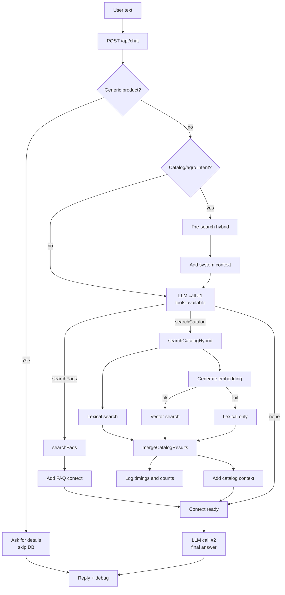

# OpenRouterRAG

Assistente de FAQ e catálogo com RAG híbrido (lexical + vetorial) via OpenRouter, Express e Vite.

## Hybrid RAG flow (chat)

## Testes rápidos

- Híbrido direto: `curl -X POST http://localhost:3000/api/rag/search -H "Content-Type: application/json" -d '{"query":"adubo foliar","limit":5}'`
- Chat end-to-end: perguntar sobre um produto; o retorno inclui `debug` com flags do RAG.
