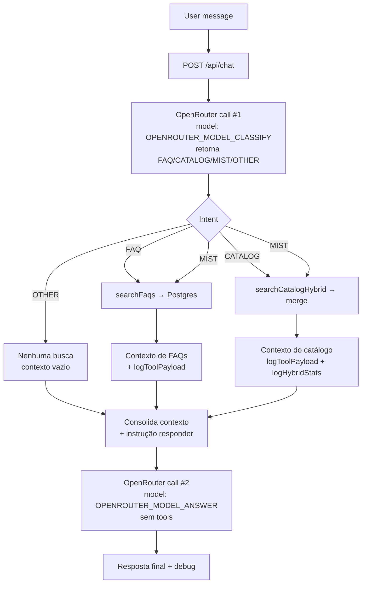

# OpenRouterRAG

Assistente de FAQ e catálogo com RAG híbrido (lexical + vetorial) via OpenRouter, Express e Vite.

## System flow

- Chamada #1 (classificação) instrui a IA a retornar **apenas uma palavra** (`FAQ`, `CATALOG`, `MIST`, `OTHER`), registrando o modelo usado (`OPENROUTER_MODEL_CLASSIFY` ou fallback).
- O backend decide quais buscas executar com base na intenção (`searchFaqs`, `searchCatalogHybrid`, ambos ou nenhum), monta um único contexto e registra logs (`classification=...`, `usedTools`, `llmCalls=0/1/2`, `logToolPayload`, `logHybridStats`).
- Chamada #2 (`OPENROUTER_MODEL_ANSWER`) recebe somente o contexto consolidado como mensagens `system` e o texto do usuário; **não usa tools** e não pode mencionar a palavra de intenção.
- O `debug` da resposta inclui a intenção detectada, modelos usados (classify/answer), flags de banco, contagens de FAQs/itens, `ragSource`, `usedTools` e `llmCalls` coerente com as buscas disparadas.

## Testes rápidos

- Híbrido direto: `curl -X POST http://localhost:3000/api/rag/search -H "Content-Type: application/json" -d '{"query":"adubo foliar","limit":5}'`
- Chat end-to-end: perguntar sobre um produto; o retorno inclui `debug` com flags do RAG.

## Painel de instruções editável

- O backend expõe `GET /api/instructions` (filtro opcional `?scope=chat,catalog`) e `PUT /api/instructions/:slug` para atualizar o conteúdo versionado na tabela `system_instructions`.
- A SPA mostra o painel diretamente nas páginas de Chat e Catálogo, reutilizando o componente `InstructionsPanel` para listar, editar e salvar instruções com React Query.
- O prompt do chat passou a ser dividido em duas mensagens `system`: `buscar-dados` (etapa 1, coleta de contexto) e `responder-usuario` (etapa 2, formatação da resposta). Ambas são lidas do banco em ordem determinística e têm fallback codificado caso o registro seja removido.
- Após atualizar `shared/schema.ts`, rode `npm run db:push` para criar/alterar a tabela e inserir os seeds (`global-operating-principles`, `buscar-dados`, `responder-usuario`, `catalog-guidelines`).

## Importação em lote do catálogo

- `GET /api/catalog/import/template` gera a planilha `.xlsx` com cabeçalho fixo (Nome, Descrição, Categoria, Fabricante, Preço, Status, Tags) e duas linhas de exemplo.
- `POST /api/catalog/import` aceita apenas `.xlsx` (5MB, 500 linhas úteis) via `multipart/form-data` com campo `file`; valida cabeçalho, deduplica linhas por par nome+fabricante e aplica o schema existente do catálogo.
- Em caso de erro, retorna `400` com `{ errors: [{ row, fields, message }] }` sem inserir nada. Sucesso retorna `{ created, durationMs, sampleIds }`.
- A página `/catalogo` tem a seção “Importar catálogo em lote” com download do template, upload arraste-e-solte e resumo de erros ou itens criados; ao concluir, a lista é atualizada automaticamente.
